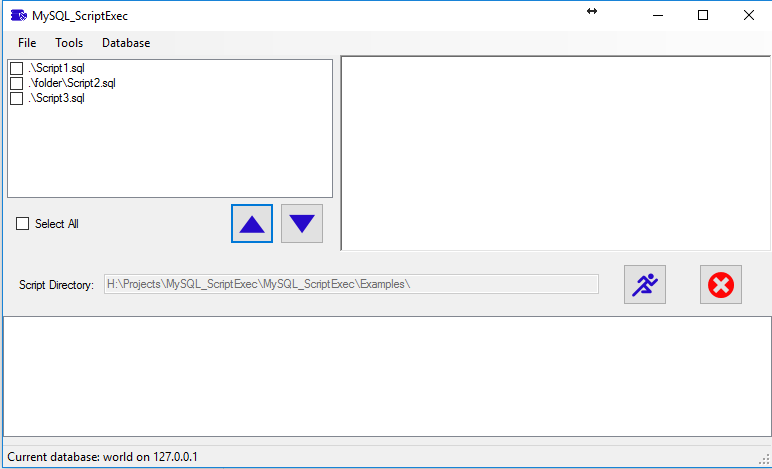
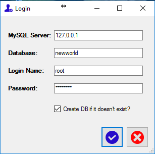
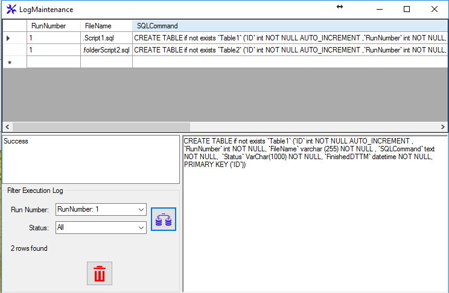
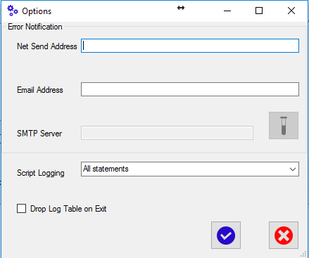

# MYSQL_ScriptExec
Utility to execute MySQL scripts or multiple scripts from text file.

Initially, a connection must be established to and database.  You can optionally specify a database that does not
exist, and by checking the 'created if does not exist' checkbox, the system will created and empty database.  Otherwise, a non-existent database will
result in an error message.

If desired, MySQL_ScriptExec runs can be logged to a table for review in the LogMaintenance page:

Options are set on the options page:

This utility is based on a SQL Server utility created by <a href="http://sqlblog.com/blogs/roman_rehak">Roman Rehak</a>

Example folder contains sample text files and scripts to demonstrate how to format them for execution.   The samples use the MySQL 'world' schema.
